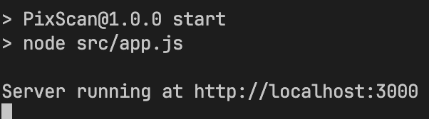

# Pix Scan

## Description
This service is responsible how to verify and validate Pix Payments receipts. Its sended a receipt how base64, then the API will validate this receipt.

## Routes ready to use

| Path                    | Method   |         Description                 |
|-------------------------|----------|-----------------------------|
| `/validateNubank`       | `POST`   | validate Nubank's receipts  |

### /validateNubank
This route validate only Nubank's receipts. For this, i use OCR (Optical Character Recognition), converting the image to text for the computer can be process.

**cURL**

`curl --location 'http://localhost:3000/validateNubank' \
--header 'Content-Type: application/json' \
--data '{
    "imageBase64":"<your image on base64>"
}'`

## Runing

For running, you should use v20.x of Node.js, then install the dependencies using `npm i `, and run `npm start`. For default, the service will run on 3000 port, after this, its only make request for the some route.

